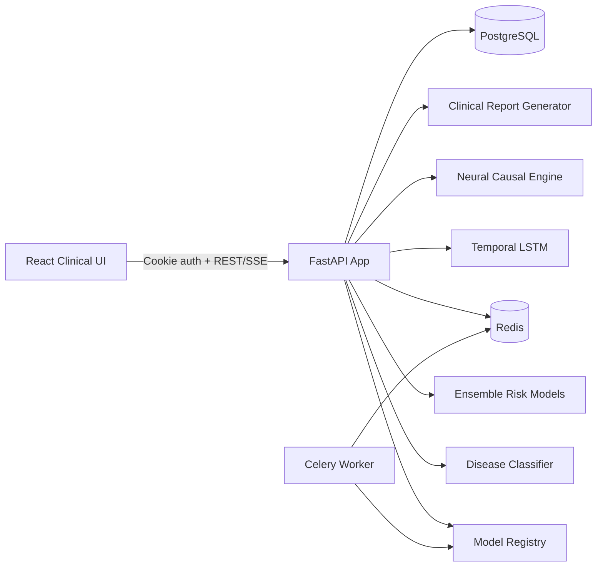
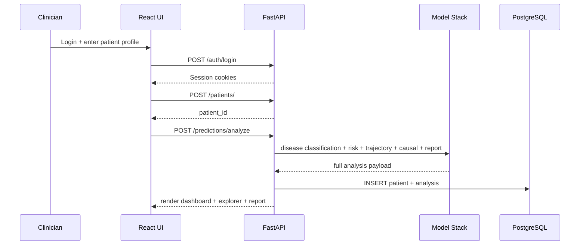

# NeuroSynth

NeuroSynth is a clinical AI platform for neurological disease risk prediction, progression forecasting, and explainable decision support.

It combines a production FastAPI backend, asynchronous orchestration, and a clinician-focused React interface that can run both locally and in hosted demo mode.

## Why NeuroSynth

- Multi-model neurological risk inference with model explainability
- Multi-disease classification (Alzheimer's, Parkinson's, MS, Epilepsy, ALS, Huntington's)
- Longitudinal 36-month trajectory forecasting
- Causal graph generation with intervention simulation
- Structured report generation for clinical review workflows
- End-to-end patient and analysis persistence in PostgreSQL

## One URL For End-to-End Local Testing

- http://localhost:8000

When static assets are built, the backend serves the frontend and API from the same origin.

## System Architecture



## Clinical Flow



## Core Capabilities

| Capability | Status | Main Surface |
|---|---|---|
| Role-based auth + cookie session | Implemented | `/auth/login`, `/auth/refresh`, `/auth/logout` |
| Synchronous full analysis | Implemented | `/predictions/analyze` |
| Async workflow orchestration | Implemented | `/predictions/run`, Celery tasks |
| Multi-disease classifier | Implemented | `disease_classification` in analyze response |
| Multi-disease risk routing | Implemented | disease-specific model selection in analyze flow |
| LSTM 36-month trajectory | Implemented | `trajectory`, `confidence_bands` |
| Causal graph + interventions | Implemented | `/causal/*`, causal graph payload |
| Live biomarker streaming | Implemented | `/biomarkers/live/{patient_id}` SSE |
| Patient history + timeline | Implemented | `/patients`, `/patients/{id}/analyses`, Explorer UI |
| Performance visualization | Implemented | `/predictions/model/performance`, `/performance` |

## Tech Stack

- Backend: FastAPI, asyncpg, Redis, Celery, pydantic-settings, slowapi, structlog
- ML: scikit-learn ensemble, PyTorch LSTM, causal model, SHAP explainability
- Frontend: React + Vite + Tailwind + Recharts + D3 components
- Data: PostgreSQL + JSONB model artifacts + filesystem model cache
- Deployment: Docker Compose for local full-stack, Vercel for frontend hosting

## Repository Layout

```text
backend/            FastAPI app, models, routers, Celery tasks
frontend/           React app and clinical UI
models/             Trained model artifacts and manifest cache
scripts/            Training and release helper scripts
tests/              Integration and quality checks
docker-compose.yml  Local orchestration (API, worker, DB, Redis)
```

## Prerequisites

- Python 3.11+ virtual environment (`.venv` recommended)
- Node.js 20+ and npm
- PostgreSQL (local) or containerized Postgres
- Redis (local) or containerized Redis
- Docker Desktop (if using compose workflow)

## Environment Configuration

Start from:

```bash
cp .env.example .env
```

Key variables:

- `NEUROSYNTH_POSTGRES_DSN`
- `NEUROSYNTH_REDIS_URL`
- `NEUROSYNTH_JWT_SECRET`
- `NEUROSYNTH_PATIENT_HASH_SECRET`
- `NEUROSYNTH_AUTH_COOKIE_SECURE`
- `NEUROSYNTH_ALLOWED_ORIGINS`

For local frontend development, keep:

```env
NEUROSYNTH_ALLOWED_ORIGINS=http://localhost:5173
```

## Quickstart A: Docker Compose (Recommended)

1. Build and launch stack:

```bash
docker compose up --build -d
```

2. Verify API health:

```bash
curl -sS http://localhost:8000/health
curl -sS http://localhost:8000/ready
```

3. Open app:

- http://localhost:8000

Notes:

- The app container serves both static frontend bundle and API.
- Worker service (`celery-worker`) starts with Redis-backed broker.

## Quickstart B: Manual Local Runtime

1. Install backend dependencies:

```bash
pip install -e '.[test]'
pip install -r backend/requirements.txt
```

2. Build frontend static assets:

```bash
cd frontend
npm install
npm run build
cd ..
rm -rf static
mkdir -p static
cp -R frontend/dist/* static/
```

3. Initialize database schema:

```bash
PGPASSWORD=postgres psql -h localhost -U postgres -d neurosynth -f backend/db_schema.sql
```

4. Start API:

```bash
PYTHONPATH=. python -m uvicorn backend.api:app --host 0.0.0.0 --port 8000
```

5. Optional: run Celery worker:

```bash
PYTHONPATH=. python -m celery -A backend.celery_app:celery_app worker -l info --concurrency=1
```

## Model Lifecycle, Caching, and Startup

NeuroSynth uses artifact caching to avoid retraining on every app start.

### Pretrain Script

```bash
PYTHONPATH=. python scripts/pretrain.py --dataset neurological_disease_data.csv --models-dir models
```

Generated outputs include:

- `models/model_manifest.json`
- ensemble model artifacts (`rf`, `gb`, `lr`, third model)
- temporal model artifact (`lstm_model.pt`)
- causal graph artifact (`causal_graph.npy`, `causal_vars.json`)
- multi-disease model directories under `models/multi/`

### Cache Validation Rules (at API startup)

On startup, the API checks:

1. Manifest exists
2. Required model files exist
3. Dataset md5 in manifest matches current dataset file

If valid, models load from disk cache.
If invalid, pretrain script is triggered automatically.

## Authentication

Demo credentials:

- `clinician@neurosynth.local` / `neurosynth`
- `researcher@neurosynth.local` / `neurosynth`
- `admin@neurosynth.local` / `neurosynth`

Login payload must include role:

```json
{
    "username": "clinician@neurosynth.local",
    "password": "neurosynth",
    "role": "CLINICIAN"
}
```

## API Verification Playbook

### 1) Login

```bash
curl -sS -c /tmp/ns.cookies \
    -H 'Content-Type: application/json' \
    -d '{"username":"clinician@neurosynth.local","password":"neurosynth","role":"CLINICIAN"}' \
    http://localhost:8000/auth/login
```

### 2) Create patient by name

```bash
curl -sS -b /tmp/ns.cookies \
    -H 'Content-Type: application/json' \
    -d '{"name":"README Validation Patient"}' \
    http://localhost:8000/patients/
```

### 3) Run full analysis

```bash
curl -sS -b /tmp/ns.cookies \
    -H 'Content-Type: application/json' \
    -d @test_payloads.json \
    http://localhost:8000/predictions/analyze
```

Expected signals:

- `probability` is model-driven (not fallback `0.5`)
- `trajectory` has 6 values
- `causal_graph.edges` is non-empty in normal model-ready state
- `disease_classification.predicted_disease` is present

### 4) Ready probe model signal

```bash
curl -sS http://localhost:8000/ready
```

Response includes `models_loaded` and infra readiness status.

### 5) Live biomarker stream

```bash
curl -N -b /tmp/ns.cookies http://localhost:8000/biomarkers/live/P-001
```

Events stream every 2 seconds with realistic AR(1)-driven vitals.

## Frontend Notes

- Keep demo mode logic in frontend API client for hosted fallback behavior.
- Sidebar now reads real probability/risk fields returned from `/patients`.
- Input panel creates patient first (name input), then calls analyze.

## Vercel Deployment (Frontend)

Deploy frontend from `frontend/` and configure runtime vars in Vercel project settings.

Recommended env:

- `VITE_API_BASE_URL=https://your-backend-domain`

If omitted on hosted domains, demo mode behavior can activate depending on environment logic.

## Testing Commands

```bash
python -m pytest -q tests/integration/test_pipeline_and_tasks_qa.py
```

```bash
cd frontend && npm run build
```

## Troubleshooting

### API starts but /ready is degraded

- Check Postgres DSN and Redis URL in `.env`
- Verify services are listening on expected ports
- `models_loaded: true` with `database/redis: false` means ML loaded but infra is unavailable

### Slow startup

- Ensure `models/model_manifest.json` exists and dataset hash has not changed
- If retraining is intended, run pretrain once manually and restart

### CORS issues in browser

- Confirm `NEUROSYNTH_ALLOWED_ORIGINS` includes your frontend origin
- Confirm browser request origin matches exactly (scheme + host + port)

### Frontend shows stale UI

- Rebuild frontend (`npm run build`) and refresh static bundle in `static/`
- Clear browser cache when validating CSS/JS bundle changes

### Vercel checks fail for missing secret references

- Prefer project environment variables in Vercel settings
- Keep `frontend/vercel.json` minimal unless explicit secret mapping exists in Vercel

## Security and Clinical Disclaimer

NeuroSynth is a clinical AI support platform intended for research and decision support workflows. It is not a replacement for physician judgment, diagnosis, or treatment planning.

Before production clinical use, perform compliance, validation, privacy, and model governance reviews appropriate to your regulatory environment.
